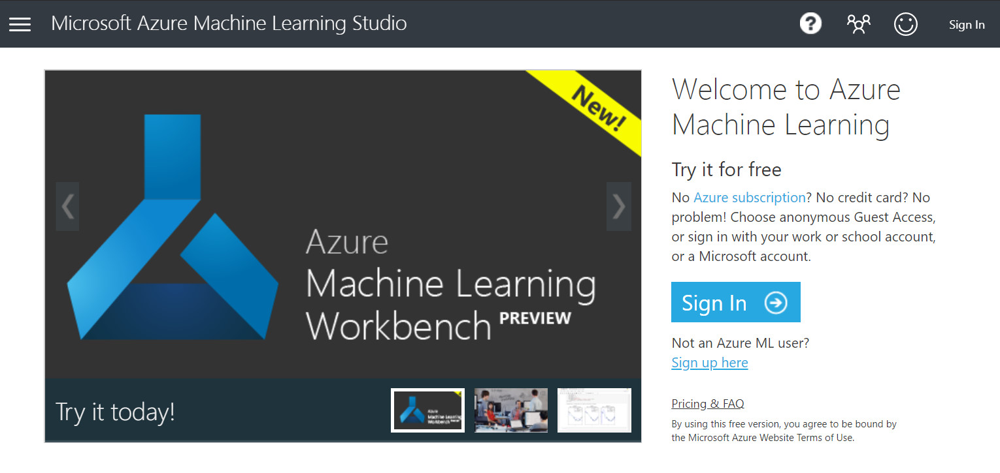
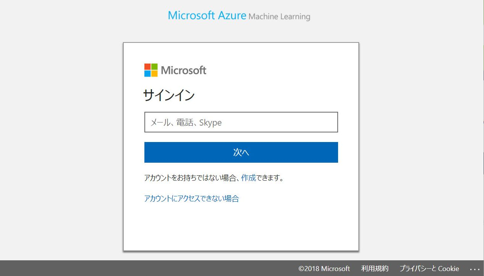

# 概要
Machine Learning Challenge では、[Azure Machine Learning Studio](https://azure.microsoft.com/services/machine-learning-studio/)を使用して、主要な米国航空会社の到着時刻データを利用したシンプルな（そして非常に正確な）機械学習のモデルを構築します。
そのときには、自分自身でモデルをチューニングして精度を高めます。
目標は、所定のフライトが到着予定時刻通りに到着する可能性を予測するための、実世界で有用なモデルを作成することです。

## 前提条件
- Microsoft のアカウント（[https://account.microsoft.com/account]()）
- Microsoft Edge や Google Chrome などの最新のブラウザ


# 演習
Machine Learning Challenge では、以下の演習を実施します。
- 演習1：機械学習の実験を作成する
- 演習2：データセットを読み込む
- 演習3：分類モデルを訓練する
- 演習4：モデルをチューニングする


# 演習1：機械学習の実験を作成する
最初のステップでは、Azure Machine Learning Studio を使用するために、機械学習の実験（Experiment）を以下の手順で作成します。

1. Webブラウザで[http://studio.azureml.net/]()に移動し、[Sign Up]をクリックします。


1. Microsoft アカウントを使用してサインインします。


1. ページの左下にある[+ NEW]をクリックし、[Blank Experiment]をクリックして、新しい実験を作成します。


1. ページ上部の実験タイトル（Experiment created on ...）をクリックし、新しい実験名として「ML Challenge」と入力します。


これで、機械学習のモデルを構築、訓練およびテストすることができる機械学習の実験を作成できました。
次のステップでは、訓練とテストに使用するためのデータセットをアップロードします。


# 演習4：モデルをチューニングする
ここからが楽しいところです。
データサイエンティストの帽子をかぶって、モデルを高い精度がでるように調整しましょう。
目標は<b>AUCを0.75以上</b>にすることです。
しかし、それには専門知識が必要です。

演習4では、その目標を達成するために6つのヒントを提供します。
これらのヒントは、熟練のデータサイエンティストがより堅牢なモデルを作成するために用いるテクニックです。
そして、AUCを0.75にするための唯一の方法ではありませんが、調整を始めるのに適しています。


## ヒント1：異なるアルゴリズムを試す
ML Studio にはモデルに使用できる9つの2値分類アルゴリズムが含まれています。
どのアルゴリズムが最良の結果をもたらすかは、熟練したデータサイエンティストでさえも試してみるまで知らないことがあります。
Azure Machine Learning では、異なるアルゴリズムを試すことは簡単で、あるモジュールを別のモジュールと交換するだけです。
これは Azure Machine Learning の強みの1つです。


演習3で作成したモデルは Two-Class Logistic Regression を使用しています。
Two-Class Logistic Regression は回帰を使用して2つの最良の結果の確率を計算する一般的なアルゴリズムです。
最適な結果を得るために異なるアルゴリズムを試してみてください。
Microsoft は予測モデルに適切なアルゴリズムを選ぶときに役立つアルゴリズムチートシートを提供しています。
[ここをクリック](http://download.microsoft.com/download/A/6/1/A613E11E-8F9C-424A-B99D-65344785C288/microsoft-machine-learning-algorithm-cheat-sheet-v6.pdf)してダウンロードしてください。


## ヒント2：キャンセルされたフライトと迂回されたフライトの影響を緩和する

使用しているデータセットには、キャンセルされたフライトと迂回されたフライトのデータが約200件含まれています。
これらのフライトにおいては、演習3の Select Columns in Dataset モジュールで除外した CANCELLED または DIVERTED の列の値が1になっています。
加えて、ARR_DEL15 の値がありません。
このことはデータセットとその結果を歪ませます。
可視化した ARR_DEL15 の値を下図に示します。
ARR_DEL15 の値は2値（0か1）のつもりですが、実際には188個の欠損値を含めた3つのユニークな値があることに注意してください。


これを解決する方法はいくつかあります。
ひとつは、欠落した ARR_DEL15 の値を持つ行を削除したり、時間どおりに到着しなかったフライトの ARR_DEL15 の値を1に置き換えたりする R や Python のスクリプトを書くことです。
そして、Execute R Script モジュールか Execute Python Script モジュールを使用して、そのスクリプトをモデルに組込みます。

あるいは、キャンセルされたフライトや迂回されたフライトを表す各行には欠損値（列にデータがない）があるため、Clean Missing Data モジュールを使用することができます。
このモジュールを使用すると、欠損値を置き換えたり、欠損値を含む行を完全に削除したりすることができます。


## ヒント3: データセットのバランスの悪さを減らす
In a perfect world, the data used to train a two-class classification model would contain a 50-50 split of positives and negatives. In the real world, it rarely does. Imbalanced datasets often (but not always) adversely affect a model's accuracy. And right now, the data in the ARR_DEL15 column of the dataset you are using — the feature whose value you are attempting to predict — exhibits significant imbalance. The ratio of on-time arrivals to late arrivals is more than 6 to 1.


Data scientists use two techniques to reduce imbalance. Upsampling increases the number of samples from the minority class — in this case, by adding more rows representing late arrivals. Downsampling does the opposite, reducing the number of samples from the majority class.

There are three ways you can reduce imbalance in the datset you were given:

- Reduce the number of rows representing on-time arrivals
- Increase the number of rows representing late arrivals by importing rows from the larger dataset in BigFlightData.csv (be careful not to duplicate rows that are already there, however, or use a Remove Duplicate Rows module to delete them)
- Increase the number of rows representing late arrivals using the Synthetic Minority Oversampling Technique (SMOTE)

Azure Machine Learning's SMOTE module makes it easy to do the latter, synthetically increasing the number of minority samples using a nearest-neighbor approach. A model that uses SMOTE to reduce imbalance takes longer to train, but often produces better results than one that doesn't.

If you introduce SMOTE, be sure to add it to the model after the Split Data module so that it only affects the training data. Otherwise, the testing data will include synthesized rows, which could lead to misleading (and incorrect) AUC numbers.

## ヒント4：出発予定時刻を2値化する
The CRS_DEP_TIME column of the dataset you are using represents scheduled departure times. The granularity of the numbers in this column — it contains 551 unique values — could have a negative impact on accuracy. This can be resolved using a technique called binning or quantization. What if you divided each number in this column by 100 and rounded down to the nearest integer? 1030 would become 10, 1925 would become 19, and so on, and you would be left with a maximum of 24 discrete values in this column. Intuitively, it makes sense, because it probably doesn't matter much whether a flight leaves at 10:30 a.m. or 10:40 a.m. It matters a great deal whether it leaves at 10:30 a.m. or 5:30 p.m.


There are several ways to accomplish binning in Azure Machine Learning. One of them is the Group Data Into Bins module. More often, data scientists prefer to write a few lines of R or Python code, which are easily incorporated into a model using Execute R Script or Execute Python Script. Here's a simple Python script that bins CRS_DEP_TIME values as described above:

```python
# Assume df is the dataframe containing the data
for index, row in df.iterrows():
    df.loc[index, 'CRS_DEP_TIME'] = math.floor(row['CRS_DEP_TIME'] / 100)
```

If binning departure times in this manner improves the accuracy of the model, you might experiment with different bin sizes as well.

## ヒント5：学習アルゴリズムを調整する
Azure Machine Learning の各アルゴリズムは、性能の調整に使用することができるパラメータを公開しています。
Two-Class Logistic Regression などのアルゴリズムモジュールをキャンバス上で選択すると、そのパラメータが Properties ペインに表示されます。


異なるパラメータを試すことによってモデルの精度が向上することがありますが、この調整には時間がかかります。
そのため、Azure Machine Learning では Tune Model Hyperparameters という名前のモジュールを提供しています。 
Train Model を Tune Model Hyperparameters で置き換えることで、訓練にかかる時間を犠牲にする代わりに、パラメータの最適な組み合わせを見つけることができます。

> Tune Model Hyperparameters を使用するとき、特に parameter sweep mode を Entire grid に設定すると、訓練にかかる時間が大幅に長くなります。


学習アルゴリズムを調整する方法は Tune Model Hyperparameters だけではありません。
その他のアイデアについては[https://docs.microsoft.com/azure/machine-learning/machine-learning-algorithm-parameters-optimize](https://docs.microsoft.com/azure/machine-learning/machine-learning-algorithm-parameters-optimize)を参照してください。


## ヒント6：より大きいデータセットで訓練する
BigFlightData.csv には、モデルを訓練したデータセットの約4倍のデータセットが含まれています。
より大きなデータセットでモデルを訓練すると、精度が向上することがあります。
ただし、訓練には時間がかかるため、小さなデータセットでモデルを調整してから、より大きなデータセットを導入するとよいでしょう。

目標は0.75以上のAUCの値を達成することです。
もし達成することができたら、あなたはデータサイエンティストのように考えることを学んだと言えるでしょう！