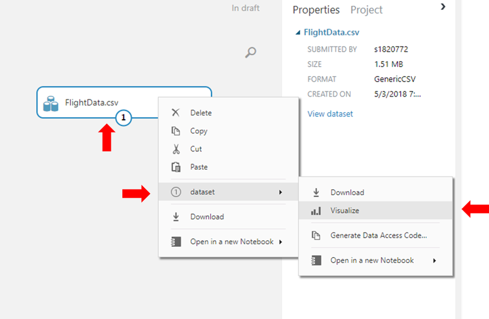

# 概要
Machine Learning Challenge では、[Azure Machine Learning Studio](https://azure.microsoft.com/services/machine-learning-studio/)を使用して、主要な米国航空会社の到着時刻データを利用したシンプルな（そして非常に正確な）機械学習のモデルを構築します。
そのご、予測モデルをチューニングして精度を高めます。
目標は、所定のフライトが到着予定時刻通りに到着する可能性を予測するモデルを作成することです。

## 前提条件
- Microsoft のアカウント
- Microsoft Edge や Google Chrome などの最新のブラウザ

# 演習
Machine Learning Challenge では、以下の演習を実施します。
- 演習1：機械学習の実験を作成する
- 演習2：データセットを読み込む
- 演習3：分類モデルを訓練する
- 演習4：モデルをチューニングする


# 演習1：機械学習の実験を作成する
最初のステップでは、Azure Machine Learning Studio を使用するために、機械学習の実験（Experiment）を以下の手順で作成します。

1. Webブラウザで[https://azure.microsoft.com/ja-jp/services/machine-learning-studio/](https://azure.microsoft.com/ja-jp/services/machine-learning-studio/)に移動し、いますぐご利用くださいをクリックします。


1. 真ん中のSign Inを押します．

>8時間トライアル版では，後々DATASETのLocal FileをUploadできないので注意．

1. ページの左下にある[+ NEW]をクリックし、[Blank Experiment]をクリックして、新しい実験を作成します。


1. ページ上部の実験タイトル（Experiment created on ...）をクリックし、新しい実験名として「ML Challenge」と入力します。


これで、機械学習のモデルを構築、訓練およびテストすることができる機械学習の実験を作成できました。
次のステップでは、訓練とテストに使用するためのデータセットをアップロードします。


# 演習2：データセットの読み込み
Azule ML Studioには「実験」にデータを読み込むための仕組みが複数用意されています。この演習では、Azure blob Storageサービス上に用意されているZipファイルをダウンロードし、ML Studioに用意されているローカルファイルの読み込み機能(From Local File)を使って演習1で作成した「実験」にデータセットを追加します。

データセットには、米国大手の航空会社の飛行機到着時刻が含まれています。
なお、このデータセットは[アメリカ交通統計局](https://www.bts.gov/)が提供する[データセット](https://www.transtats.bts.gov/DL_SelectFields.asp?Table_ID=236&DB_Short_Name=On-Time)のサブセット版です。

1. Zipファイルを[こちら](https://mlchallenge.blob.core.windows.net/public/FlightData.zip)からダウンロードし、中に含まれているFlightData.csvとBigFlightData.csvを取り出します。
>FlightData.csvは11231件のデータが、BigFlightData.csvは44360件のデータが含まれており、FlightData.csvはBigFlightData.csvのサブセットになっています。
>演習3では学習時間短縮のためデータ数が少ないFlightData.csvを使いますが、演習4ではお好みでBigFlightData.csvを用いてもらっても構いません。

2. ML Studioの戻り、「NEW」を選択し、「DATASET」から「FROM LOCAL FILE」を選択します。
そして，Upload a new datasetダイアログの「Brouse」ボタンを選択し、保存したFlightData.csvを選択します。
SELECT A TYPE FOR THE NEW DATASETが「Generic CSV File with a header(.csv)」になっていることを確認し、右下の「チェックボタン」を押してデータセットをアップロードします。


3. データセットアップロード後、「Module Pallete」に戻り、左側のメニュー「Saved Datasets」以下にある「FlightData.csv」を探し、パレット上にドラッグ・アンド・ドロップします。


4. このデータセットに何が含まれているかを確認してみます。パレット上「FlightData.csv」を右クリックし、「Visualize」を選択します。


5. データセットの中身が表示されます。このデータセットは11231行、25列のデータを含みます。
各行は1回の飛行を表し、飛行日(YEAR, MONTH, DAY_OF_MONTH)や飛行に関する例えば出発地(ORIGIN)と目的地(DEST)、予定出発時刻(CRS_DEP_TIME)と到着時刻(CRS_ARR_TIME)、到着時刻の遅れ(ARR_DELAY)や15分以上遅れていたかどうか(ARR_DEL15)などが含まれます。

以下に各行の意味を示します。
なお、時刻はHHMMという形式で保存されています。(例:午後3時-1500)

|Column|Description|
|---------------------|----------------------------------------------------------------------------------|
|YEAR|飛行年|
|QUARTER|飛行四半期 (1-4)|
|MONTH|飛行月 (1-12)|
|DAY_OF_MONTH|飛行日 (1-31)|
|DAY_OF_WEEK|飛行曜日 (1=月曜, 2=火曜...)|
|UNIQUE_CARRIER|航空会社コード (例：DL, NH)|
|TAIL_NUM|機体番号|
|FL_NUM|便番号|
|ORIGIN_AIRPORT_ID|出発空港ID|
|ORIGIN|出発空港コード (例：ATL, DFW, HND)|
|DEST_AIRPORT_ID|到着空港ID|
|DEST|到着空港コード (例：ATL, DFW, HND)|
|CRS_DEP_TIME|出発予定時刻|
|DEP_TIME|実際の出発時刻|
|DEP_DELAY|出発時間の遅れ|
|DEP_DEL15|0=15分未満の出発の遅れ, 1=15分以上の出発の遅れ|
|CRS_ARR_TIME|到着予定時刻|
|ARR_TIME|実際の到着時刻|
|ARR_DELAY|到着時間の遅れ|
|ARR_DEL15|0=15分未満の到着の遅れ, 1=15分以上の到着の遅れ|
|CANCELLED|0=飛行が行われた, 1=飛行は中止された|
|DIVERTED|0=予定通りの目的地へ着陸した, 1=予定外の目的地へ着陸した|
|CRS_ELAPSED_TIME|予定されている飛行時間(分)|
|ACTUAL_ELAPSED_TIME|実際の飛行時間(分)|
|DISTANCE|出発地と目的地の距離(マイル)|

> なお、これらすべてのデータが予測モデルに用いられるわけではありません。
> 例えば飛行機の機体番号が特定のものだからと飛行が遅れたり、飛行が中止されたり、予定外の空港に着陸するということはないように、機体番号は飛行時間の予測には用いることが出来ません。
> このように明らかに予測モデルに用いれないものが含まれていても、モデル作成時に除外することが出来ます。

6. データセットの列を適当に選択すると、右側の列に詳細が表示されます。


7. 右上の×ボタンを押して「Visualize」ウィンドウを閉じます。

これでデータセットが読み込まれます。

# 演習3 分類器の学習

この章では MLスタジオのドラッグアンドドロップUIを使用してモデルを構築、学習アルゴリズムを選択し、学習に使うデータを選択して、学習させます。

機械学習のモデルにはいくつかの種類があり、有名なものの一つに回帰モデルがあります。
多数の回帰アルゴリズムのいずれかを利用し数値を生成するモデルで、例えば、年齢やクレジットカードの取引が不正であるかどうかを判定するのに用いられています。

今回は複数の入力データから既知の出力の一つを出力する分類モデルを学習させます。

分類モデルの古典的な例は電子メールの本文から迷惑メールかそうでないかを分類するものです。

ここでは第2章で読み込ませたデータセットを利用し、飛行機が定刻に到着するか遅刻するかを予測する分類器を学習させます。

1. モジュールパレット上部の検索ボックスに「select columns」を入力し、データセットモジュールの「Select Columns in Data Set」を見つけます。
モジュールをキャンバス上にドラッグし、データセットの下にドロップします。
次に、データセットの出力ポートをドラッグし、表示された矢印を「Select Columns in Data Set」モジュールの入力ポートに接続します。

> Azure ML Studioでは「ポート」と「コネクタ」という概念があります。
> 先程データセットの出力ポートを「Select Columns in Data Set」モジュールの入力ポートに接続しました。
> このようにモジュール間を接続することでデータを次のモジュールに伝えることが出来ます。
> また、モジュールは複数の入出力ポートをサポートしているため、モジュールによっては入力や出力ポートが複数あります。
> ポートが何をするのかを知りたい場合は、ポートの上にカーソルを乗せるとツールチップが表示されます。
> 更に詳しい情報は、モジュールを右クリックし、ポップアップメニューから「Help」を選択してください。


2. データセットモジュール内の「Select Columns in Data Set」を選択し、右側プロパティーパネルに表示される「Launch column selector」を選択します。


3. 「Available Columns」から以下の項目を選択します。

* MONTH
* DAY_OF_MONTH
* DAY_OF_WEEK
* ORIGIN
* DEST
* CRS_DEP_TIME
* ARR_DEL15

次に右矢印ボタンをクリックし、右側「Selecteed Columns」に選択した項目が追加します。これらは予測モデルに用いられる特徴量となります。
特徴量を選択したらダイアログ右下にある完了ボタンを押します。


4. モジュールパレット上部の検索ボックスに「edit」と入力し、「Edit Metadata」モジュールを探し、キャンバスに追加します。
追加したあと、「Select Columns in Data Set」モジュールに接続します。
Edit Metadataについては[こちら(英語)](https://docs.microsoft.com/en-us/azure/machine-learning/studio-module-reference/edit-metadata)を御覧ください。


5. 次に追加した「Edit Metadata」モジュールを選択し、右側プロパティーパネルに表示される「Launch column selector」を選択し、表示される空欄に「ARR_DEL15」を入力し、右下の完了ボタンを押します。


6. サイド右側のプロパティーパネルを編集します。「Categorical」から「Make categorical」を選択します。これによりARR_DEL15は数値ではなくカテゴリーであるということを示します。また、「Fields」から「Label」を選択します。これはARR_DEL15がモデルの予測対象であるということを示します。


7. 次に「Split Data」モジュールを追加し、「Edit Metadata」モジュールへ接続します。このモジュールは入力されたデータセットを、学習用とテスト用に分割します。今回のようにデータセットが学習用とテスト用に分割して提供されていない場合は、このモジュールを利用します。
キャンバス上で「Split　Data」モジュールを選択し、右側のプロパティーパネルの「Fraction of rows in the first output dataset」を0.8にします。これはデータをどれくらいの比率で分割するかを示すもので0.8にした場合左側(1)に80%、右側(2)に20%のデータが次のモジュールへ送られます。
Split Dataについては[こちら(英語)](https://docs.microsoft.com/en-us/azure/machine-learning/studio-module-reference/split-data)を御覧ください。


8. 「Train Model」モジュールを追加し、「Split Data」モジュール左側の出力を「Train Model」の右側の入力に接続します。次に「Two-Class Logistic Regression」モジュールを追加し、その出力を「Train Model」モジュールの左側の入力に接続します。
Train Modelモジュールについては[こちら(英語)](https://msdn.microsoft.com/en-us/library/azure/dn906044.aspx)を、Two-Class Logistic Regressionモジュールについては[こちら(英語)](https://docs.microsoft.com/en-us/azure/machine-learning/studio-module-reference/two-class-logistic-regression)を御覧ください。
> ロジスティック回帰とは、発生確率を予測する手法で、例えば遅刻するか否かの確率を予測するときに利用でき、分類問題でも用いられています。
> Azure ML StudioではTrain ModelにTwo-Class Logistic Regressionモジュールを接続するように学習アルゴリズムを指定することが出来ます。
> そのため、あとから学習アルゴリズムを変更することが容易です。


9. Train Modelを選択し、プロパティパネルの「Launch column selector」を選択します。表示れるダイアログで「ARR_DEL15」の列を選択し、右下のチェックボタンを押します。
これは、TrainModelにどの値を予測するかを指定します（重要）。


10. 「Score Model」モジュールと「Evaluate Model」モジュールを追加し、図のように接続します。
Score Modelモジュールについては[こちら(英語)](https://docs.microsoft.com/en-us/azure/machine-learning/studio-module-reference/score-model)を、Evaluate Modelモジュールについては[こちら(英語)](https://docs.microsoft.com/en-us/azure/machine-learning/studio-module-reference/evaluate-model)を御覧ください。


11. 最後に作成したモデルを保存するため、ページ下部の「Save」ボタンを押します。続けて、「Run」ボタンを押して、アップロードしたデータセットを利用しモデルを学習させます（数分かかります）。


12. 学習終了後、「Evalute Mode」モジュールの出力ポートをクリックし、「Visualize」ボタンを押し、モデルの精度を確認します。スクロールすると正確度(accuracy)、精度(precision)、AUC(Area Under Curve)などが表示されます。


2値分類モデルの精度を図る方法はいくつかあります。図の例では正確度は87%, 精度は1.000であり、良さそうに見えますが、精度と再現性(recall)の加重平均であるF1スコアは0でAUCは0.579です。これは58%の確率で正しい予測ができ、あとは間違うというものであり、ほぼランダムに近い予測モデルとなっています。
精度、正確度などについては[こちら(英語)](https://blogs.msdn.microsoft.com/andreasderuiter/2015/02/09/performance-measures-in-azure-ml-accuracy-precision-recall-and-f1-score/)を御覧ください。
予測モデルの品質を向上するためにAUCを利用します。また、ROC曲線はVisualizationウィンドウ上部に表示されます。

ROC曲線は青線で示され、グレーの対角線は予測モデルが50%で正解をあてる(=完全にランダム)時の確率を示します。
この例ではグレーの線に曲線が近いため、あまり良いモデルではない事がわかります。
チューニングすることで例えばAUCが0.92の場合ROC曲線は次のようになります。

しかし、今回のデータセットには遅延に影響しそうな要因（天気など）が含まれていないため、このモデルではAUCが0.92になることはほぼ有りえませんが、次の演習ではこのAUCをなるべく良くすることが目標になります。

13. Visualizationウィンドウ右上のXボタンを押して閉じます。

# 演習4：モデルをチューニングする
ここからが楽しいところです。
データサイエンティストの帽子をかぶって、高い精度がでるようにモデルを調整しましょう。
目標は<b>AUCを0.75以上</b>にすることです。
しかし、それには専門知識が必要です。

演習4では、その目標を達成するために6つのヒントを提供します。
これらのヒントは、熟練のデータサイエンティストがより堅牢なモデルを作成するために用いるテクニックです。
これらはAUCを0.75にするための唯一の方法ではありませんが、モデルの調整を始めるのに適しています。


## ヒント1：異なるアルゴリズムを試す
ML Studio にはモデルに使用できる9つの2値分類アルゴリズムが含まれています。
どのアルゴリズムが最良の結果をもたらすかは、熟練したデータサイエンティストでさえも試してみるまで分からないことがあります。
Azure Machine Learning では、異なるアルゴリズムを試すことは簡単で、あるモジュールを別のモジュールと交換するだけです。
これは Azure Machine Learning の強みの1つです。


演習3で作成したモデルは [Two-Class Logistic Regression](https://msdn.microsoft.com/library/azure/dn905994.aspx) を使用しています。
Two-Class Logistic Regression は回帰を使用して2つの最良の結果の確率を計算する一般的なアルゴリズムです。
最適な結果を得るために異なるアルゴリズムを試してみてください。
Microsoft は予測モデルに適切なアルゴリズムを選ぶときに役立つアルゴリズムチートシートを提供しています。
[ここをクリック](http://download.microsoft.com/download/A/6/1/A613E11E-8F9C-424A-B99D-65344785C288/microsoft-machine-learning-algorithm-cheat-sheet-v6.pdf)してダウンロードしてください。


## ヒント2：キャンセルされたフライトと迂回されたフライトの影響を緩和する

使用しているデータセットには、キャンセルされたフライトまたは迂回されたフライトを表すデータが約200件含まれています。
これらのフライトは、演習3の [Select Columns in Dataset](https://msdn.microsoft.com/library/azure/dn905883.aspx) モジュールで除外した CANCELLED または DIVERTED の列の値が1で表されています。
キャンセルされたフライトまたは迂回されたフライトを表す行には ARR_DEL15 の値がありません。
このことはデータセットとその結果を歪ませます。
可視化した ARR_DEL15 の値を下図に示します。
ARR_DEL15 の値は2値（0か1）のつもりですが、実際には188個の欠損値を含めた3つのユニークな値があることに注意してください。


これを解決する方法はいくつかあります。
ひとつは、欠損した ARR_DEL15 の値を持つ行を削除したり、時間どおりに到着しなかったフライトの ARR_DEL15 の値を1に置き換えたりする R や Python のスクリプトを書くことです。
そして、[Execute R Script](https://msdn.microsoft.com/library/azure/dn905952.aspx) モジュールか [Execute Python Script](https://msdn.microsoft.com/library/azure/dn955437.aspx) モジュールを使用して、そのスクリプトをモデルに組込みます。

あるいは、キャンセルされたフライトまたは迂回されたフライトを表す各行には欠損値（列にデータがない）があるため、[Clean Missing Data](https://msdn.microsoft.com/library/azure/dn906028.aspx) モジュールを使用することができます。
このモジュールを使用すると、欠損値を置き換えたり、欠損値を含む行を完全に削除したりすることができます。


## ヒント3: データセットのバランスの悪さを減らす
2クラス分類モデルを訓練するために使用されるデータは Positive と Negative を半分づつ含んでいることが理想です。
しかし、現実の世界でそうなっていることはまれです。
バランスの悪いデータセットは（必ずしもそうとは限りませんが）モデルの精度に悪影響を与えることがあります。
そして、いま使用しているデータセットの ARR_DEL15 列のデータ（値を予測する対象）はかなりバランスが悪くなっています。
時間どおりに到着したことを表すデータと遅れて到着したことを表すデータの比率は6対1を超えています。


データサイエンティストはこのバランスの悪さを解決するために2つのテクニックを使用します。
ひとつは、アップサンプリングです。
アップサンプリングは、少数派のクラスのサンプル数を増やします。
今回の場合は、遅れて到着する行を追加します。
もうひとつは、ダウンサンプリングです。
ダウンサンプリングは、逆に多数派のクラスのサンプル数を減らします。

今回は、データセットのバランスの悪さを解決するための方法が3つあります。
- 時間どおりに到着したことを表す行の数を減らす。
- <b>BigFlightData.csv</b> にある大きなデータセットから行をインポートすることで、遅れて到着したことを表す行の数を増やす。（ただし、既に存在する行を複製しないように注意してください。または、[Remove Duplicate Rows](https://msdn.microsoft.com/library/azure/dn905805.aspx) モジュールを使用して重複する行を削除してください。）
- [SMOTE(Synthetic Minority Oversampling Technique)](https://www.jair.org/media/953/live-953-2037-jair.pdf) を使用して遅れて到着したことを表す行の数を増やす。

Azure Machine Learning の [SMOTE](https://msdn.microsoft.com/library/azure/dn913076.aspx) モジュールは、最近傍法を使用して少数派のサンプル数を合成的に増やします。
バランスの悪さを解消するために SMOTE を使用するモデルは訓練に時間がかかりますが、SMOTE を使用しないモデルよりも良い結果が得られることがあります。

SMOTE を導入する場合は、それを Split Data モジュールの後ろにあるモデルに追加して、訓練データにのみ影響を与えるように注意してください。
そうしないと、テストデータに合成された行が含まれ、誤った（不正確な）AUCの値になる可能性があります。

## ヒント4：出発予定時刻をビニングする
使用しているデータセットの CRS_DEP_TIME 列は出発予定時刻を表しています。
この列の数値の粒度 （ユニークな値を551個含む）は精度に悪影響を及ぼす可能性があります。
これは[ビニング](http://data-informed.com/enhance-machine-learning-with-standardizing-binning-reducing/)や量子化と呼ばれるテクニックを使用して解決することが可能です。
この列の各数値を100で割り、最も近い整数に切り捨てられた場合はどうなりますか？
1030が10になり、1925が19になるなど、この列に最大24の離散値が残されます。
直感的に言えば、フライトが午前10時30分または午前10時40分に出発するかどうかは問題ではありません。
対して、午前10時30分または午後5時30分に出発するかどうかは大変重要なことです。


Azure Machine Learning においてビニングする方法はいくつかあります。
そのうちの1つは、[Group Data Into Bins](https://msdn.microsoft.com/library/azure/dn913065.aspx) モジュールを使用することです。
多くの場合、データサイエンティストは数行の R または Python のコードを書くことを好みます。
そして、これらのコードは [Execute R Script](https://msdn.microsoft.com/library/azure/dn905952.aspx) または [Execute Python Script](https://msdn.microsoft.com/library/azure/dn955437.aspx) を使用してモデルに簡単に組み込むことができます。
CRS_DEP_TIME の値をビニングする簡単な Python のスクリプトを以下に示します。

```python
# df はデータを含むデータフレーム
for index, row in df.iterrows():
    df.loc[index, 'CRS_DEP_TIME'] = math.floor(row['CRS_DEP_TIME'] / 100)
```

このようにして出発時刻をビニングするとモデルの精度が向上する場合は、異なるビンサイズを試してみてもよいでしょう。

## ヒント5：学習アルゴリズムを調整する
Azure Machine Learning の各アルゴリズムは、性能の調整に使用することができるパラメータを公開しています。
[Two-Class Logistic Regression](https://msdn.microsoft.com/library/azure/dn905994.aspx) などのアルゴリズムモジュールをキャンバス上で選択すると、そのパラメータが Properties ペインに表示されます。


異なるパラメータを試すことによってモデルの精度が向上することがありますが、この調整には時間がかかります。
そのため、Azure Machine Learning では [Tune Model Hyperparameters](https://msdn.microsoft.com/library/azure/dn905810.aspx) という名前のモジュールを提供しています。 
[Train Model](https://msdn.microsoft.com/library/azure/dn906044.aspx) を Tune Model Hyperparameters で置き換えることで、訓練に時間をかける代わりに、パラメータの最適な組み合わせを見つけることができます。

> Tune Model Hyperparameters を使用するとき、特に parameter sweep mode を <b>Entire grid</b> に設定すると、訓練にかかる時間が大幅に長くなります。


学習アルゴリズムを調整する方法は Tune Model Hyperparameters だけではありません。
その他のアイデアについては [https://docs.microsoft.com/azure/machine-learning/machine-learning-algorithm-parameters-optimize](https://docs.microsoft.com/azure/machine-learning/machine-learning-algorithm-parameters-optimize) を参照してください。


## ヒント6：より大きいデータセットで訓練する
<b>BigFlightData.csv</b> には、モデルの訓練に使用したデータセットの約4倍のデータセットが含まれています。
より大きなデータセットでモデルを訓練すると、精度が向上することがあります。
ただし、訓練には時間がかかるため、小さなデータセットでモデルを調整してから、より大きなデータセットを導入するとよいでしょう。

目標は<b>0.75以上</b>のAUCの値を達成することでした。
もし達成することができたら、あなたはデータサイエンティストのように考えることを学んだと言えるでしょう！

